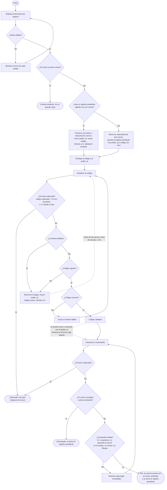

# Flujo de registro (Mermaid)

Versión en texto del [diagrama original](flujo-registro.png), ajustada a la spec aprobada. Los
cambios respecto a la imagen están en la sección final.

## Cambios respecto al diagrama original
- La comprobación de cuenta existente va después de validar los datos: si fuera antes, la
  respuesta revelaría qué correos tienen cuenta.
- Se añaden los intentos fallidos y el bloqueo (RF-010), la vida máxima de 1 hora (RF-011), el
  registro repetido (RF-005) y el caso de cuenta creada entretanto (RF-012).
- El límite de frecuencia del reenvío queda fuera de esta feature (S-01).
- Los tiempos y el número de intentos son los valores por defecto; se ajustan por configuración
  (RF-019).
